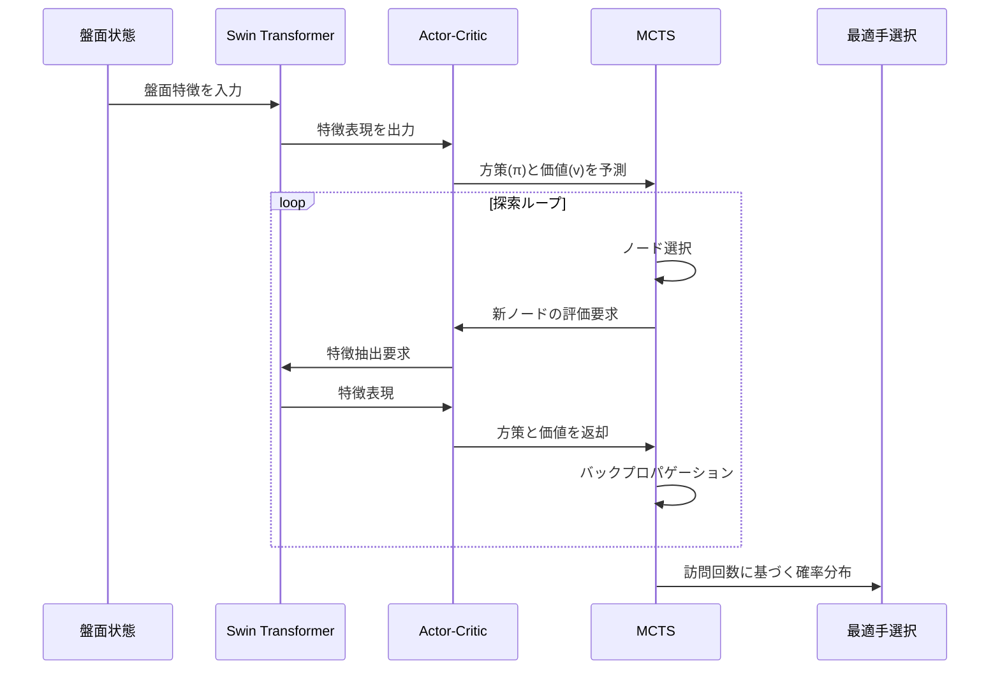

# SwinShogi

SwinShogiは、Swin Transformerを使用した将棋AIシステムです。強化学習と深層学習を組み合わせ、高性能な将棋エンジンを目指しています。

## 主な特徴

- **Swin Transformer**による深層学習モデル
- 交差エントロピー損失による方策学習
- モンテカルロ木探索（MCTS）による思考ルーチン
- JAXによる高速化と最適化
- USI（Universal Shogi Interface）プロトコル対応インターフェース
- 自己対局と外部エンジン対戦による評価システム
- 将棋の完全なルール実装（打ち歩詰め禁止、王手判定、詰み判定、千日手検出など）

## システムアーキテクチャ

以下の図はSwinShogiの主要コンポーネント間の連携シーケンスを示しています：



## プロジェクト構成

```
SwinShogi/
  - config/       # 設定ファイル
  - data/         # 学習・評価用データ
  - scripts/      # 実行スクリプト
  - src/          # ソースコード
    - interface/  # USIインターフェース
    - model/      # Swin Transformerモデル
    - rl/         # 強化学習アルゴリズム
    - shogi/      # 将棋ルール
    - tests/      # テストコード
    - utils/      # ユーティリティ
```

## モジュール構成

### モデル (src/model/)

- **shogi_model.py**: Swin Transformerベースの将棋モデル定義
  - `SwinShogiModel`: メインのモデルクラス。方策（着手確率）と価値（勝率評価）を出力
  - `create_swin_shogi_model`: モデルとパラメータを初期化する関数
  
- **swin_transformer.py**: Swin Transformer実装
  - `WindowAttention`: ウィンドウ内の注意機構
  - `SwinTransformerBlock`: 基本ブロック（MSAとFFNを含む）
  - `BasicLayer`: 複数のブロックとダウンサンプリングを含むレイヤー
  - `PatchEmbed`: 入力画像をパッチに分割して埋め込む
  - `PatchMerging`: パッチのマージとダウンサンプリング処理

- **actor_critic.py**: 方策と価値を予測するネットワーク
  - `ActorCritic`: モデルをラップし、状態から行動確率と価値を予測するクラス
  - JIT最適化された推論関数を提供

### 強化学習 (src/rl/)

- **trainer.py**: モデルトレーニングクラス
  - `Trainer`: 強化学習トレーニングのメインクラス
  - `TrainState`: パラメータと最適化器の状態を管理

- **mcts.py**: モンテカルロ木探索の実装
  - `MCTS`: 探索木を管理し、最適な手を選択
  - `MCTSNode`: 探索木のノード表現
  - `MCTSParameter`: MCTS用のパラメータ管理

- **self_play.py**: 自己対戦による訓練データ生成
  - `SelfPlay`: 自己対戦を実行し、学習データを生成するクラス

### 将棋ルール (src/shogi/)

- **shogi_game.py**: 将棋ゲームのルール実装
- **shogi_pieces.py**: 駒の定義と動きの実装
- **board_encoder.py**: 盤面状態をモデル入力形式にエンコード
  - `encode_board_state`: 盤面を2チャネルの特徴量にエンコード
  - `get_feature_vector`: 手番と持ち駒を特徴ベクトルに変換
- **board_visualizer.py**: 将棋盤の可視化

### ユーティリティ (src/utils/)

- **model_utils.py**: モデル関連の共通ユーティリティ
  - `predict`: 将棋の状態からモデル推論を実行
  - `inference_jit`: JIT最適化された推論関数
  - `PolicyGradientLoss`: 方策勾配法で使用する損失関数集
    - `cross_entropy_loss`: 基本的な交差エントロピー損失
    - `policy_loss`: アドバンテージ重み付き損失（オプション）
    - `value_loss`: 価値関数の二乗誤差損失
    - `entropy_loss`: 方策のエントロピー損失
    - `compute_losses_from_model_outputs`: 総合損失計算関数
  - 勾配処理関数群
    - `calculate_gradient_norm`: 勾配のグローバルノルム計算
    - `clip_gradients`: 勾配のクリッピング
    - `process_gradients`: 勾配の処理（ノルム計算とクリッピング）

- **jax_utils.py**: JAX関連のユーティリティ関数
  - `setup_jax`: JAXの設定とGPU検出
  - `create_rng_keys`: 乱数生成キーの作成

- **performance.py**: パフォーマンス計測と最適化
  - `benchmark_inference`: 推論速度のベンチマーク
  - `find_optimal_batch_size`: 最適なバッチサイズの探索
  - `compare_devices`: CPU/GPU性能比較
  - `profile_mcts`: MCTSのプロファイリング

### インターフェース (src/interface/)

- **usi.py**: USIプロトコル実装
  - `USIInterface`: USIコマンド処理とエンジン通信

### テスト (src/tests/)

- **test_swin_shogi.py**: SwinShogiモデルのテスト
- **test_shogi_rules.py**: 将棋ルール実装のテスト
- **test_performance_evaluation.py**: パフォーマンス評価

## 実装内容

1. **損失関数の整理と統合**
   - `PolicyGradientLoss`クラスに全ての損失関数を集約
   - `policy_loss`関数を柔軟化し、アドバンテージありなしの両方に対応
   - `compute_losses_from_model_outputs`メソッドで損失計算ロジックを抽象化

2. **勾配計算ロジックの最適化**
   - 勾配計算とクリッピングのロジックを`model_utils.py`に移動
   - `calculate_gradient_norm`, `clip_gradients`, `process_gradients`関数の追加
   - `trainer.py`の`loss_fn`関数を簡素化

3. **モデル推論の最適化**
   - JAXのJIT最適化による推論速度の向上
   - バッチ処理による効率的な計算

4. **USIインターフェース**
   - 将棋エンジン通信プロトコル対応
   - SFEN形式対応
   - 外部エンジン対戦機能

5. **評価システム**
   - 自己対局評価
   - 外部エンジン対戦評価

6. **将棋ルール**
   - 打ち歩詰め禁止
   - 王手判定
   - 詰み判定
   - 千日手検出

## 最近の更新内容

- **損失関数の整理**: `PolicyGradientLoss`クラス内の重複を排除し、`policy_loss`関数を柔軟化
- **勾配処理の改善**: 勾配計算とクリッピングのロジックを整理し、再利用性を向上
- **コード構造の最適化**: 関連する機能を論理的にグループ化し、保守性を向上
- **ダウンサンプリング処理の改良**: `BasicLayer`クラスでの特徴トークン処理を最適化 