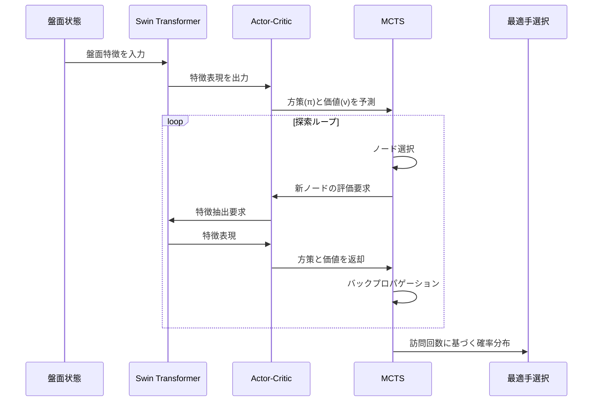

# SwinShogi

SwinShogi is a Japanese chess (shogi) AI system using Swin Transformer architecture. It combines reinforcement learning and deep learning to create a high-performance shogi engine.

SwinShogiは、Swin Transformerを使用した将棋AIシステムです。強化学習と深層学習を組み合わせ、高性能な将棋エンジンを目指しています。

このプロジェクトは依存関係管理とビルドプロセスに**Poetry**を使用しています。

## セットアップとビルド

### 1. Poetryのインストール
```bash
curl -sSL https://install.python-poetry.org | python3 -
```

### 2. プロジェクトのセットアップ
```bash
# 依存関係のインストール
poetry install

# 仮想環境の有効化
poetry shell
```

### 3. 実行
```bash
# テストの実行
poetry run python -m pytest

# トレーニングの実行
poetry run python src/rl/trainer.py
```

## 主な特徴

- **Swin Transformer**による深層学習モデル
- 交差エントロピー損失による方策学習
- モンテカルロ木探索（MCTS）による思考ルーチン
- JAXによる高速化と最適化
- USI（Universal Shogi Interface）プロトコル対応インターフェース
- 自己対局と外部エンジン対戦による評価システム
- 将棋の完全なルール実装（打ち歩詰め禁止、王手判定、詰み判定、千日手検出など）

## システムアーキテクチャ

以下の図はSwinShogiの主要コンポーネント間の連携シーケンスを示しています：



## プロジェクト構成

```
SwinShogi/
  - config/       # 設定ファイル
  - data/         # 学習・評価用データ
  - scripts/      # 実行スクリプト
  - src/          # ソースコード
    - interface/  # USIインターフェース
    - model/      # Swin Transformerモデル
    - rl/         # 強化学習アルゴリズム
    - shogi/      # 将棋ルール
    - tests/      # 内部テストコード
    - utils/      # ユーティリティ
  - tests/        # 外部テストコード
    - model/      # モデルテスト
    - rl/         # 強化学習テスト
    - shogi/      # 将棋ルールテスト
    - utils/      # ユーティリティテスト
```

## モジュール構成

### モデル (src/model/)

- **shogi_model.py**: Swin Transformerベースの将棋モデル定義
  - `SwinShogiModel`: メインのモデルクラス。方策（着手確率）と価値（勝率評価）を出力
  - `create_swin_shogi_model`: モデルとパラメータを初期化する関数
  
- **swin_transformer.py**: Swin Transformer実装
  - `WindowAttention`: ウィンドウ内の注意機構
  - `SwinTransformerBlock`: 基本ブロック（MSAとFFNを含む）
  - `BasicLayer`: 複数のブロックとダウンサンプリングを含むレイヤー
  - `PatchEmbed`: 入力画像をパッチに分割して埋め込む
  - `PatchMerging`: パッチのマージとダウンサンプリング処理

- **actor_critic.py**: 方策と価値を予測するネットワーク
  - `ActorCritic`: モデルをラップし、状態から行動確率と価値を予測するクラス
  - JIT最適化された推論関数を提供

### 強化学習 (src/rl/)

- **trainer.py**: モデルトレーニングクラス
  - `Trainer`: 強化学習トレーニングのメインクラス
  - `Trainer.create()`: ファクトリーメソッドによる統一された初期化（チェックポイント自動検出・リジューム対応）
  - `TrainState`: パラメータと最適化器の状態を管理
  - `ReplayBuffer`: 訓練例のリプレイバッファ

- **data_generator.py**: 多様なデータソースからの訓練データ生成
  - `DataGenerationManager`: 複数データソースの統合管理
  - `SelfPlayDataSource`: 自己対戦データ生成
  - `GameRecordDataSource`: 棋譜からのデータ生成
  - `AIOpponentDataSource`: 他AI対戦データ生成
  - ActorCritic中心の設計によりパラメータ同期を保証

- **mcts.py**: モンテカルロ木探索の実装
  - `MCTS`: 探索木を管理し、最適な手を選択
  - `MCTSNode`: 探索木のノード表現
  - `MCTSParameter`: MCTS用のパラメータ管理

- **self_play.py**: 自己対戦による訓練データ生成
  - `SelfPlay`: 自己対戦を実行し、学習データを生成するクラス

### 将棋ルール (src/shogi/)

- **shogi_game.py**: 将棋ゲームのルール実装
- **shogi_pieces.py**: 駒の定義と動きの実装
- **board_encoder.py**: 盤面状態をモデル入力形式にエンコード
  - `encode_board_state`: 盤面を2チャネルの特徴量にエンコード
  - `get_feature_vector`: 手番と持ち駒を特徴ベクトルに変換
- **board_visualizer.py**: 将棋盤の可視化

### ユーティリティ (src/utils/)

- **model_utils.py**: モデル関連の共通ユーティリティ
  - `predict`: 将棋の状態からモデル推論を実行
  - `inference_jit`: JIT最適化された推論関数
  - `PolicyGradientLoss`: 方策勾配法で使用する損失関数集
    - `policy_loss`: アドバンテージ対応の方策損失（None時は標準交差エントロピー）
    - `value_loss`: 価値関数の二乗誤差損失
    - `entropy_loss`: 方策のエントロピー損失
    - `compute_losses_from_model_outputs`: 汎用損失計算関数（Advantage対応）
    - `compute_alphazero_losses`: AlphaZero専用損失関数（Advantageなし）
  - 勾配処理関数群
    - `calculate_gradient_norm`: 勾配のグローバルノルム計算
    - `clip_gradients`: 勾配のクリッピング
    - `process_gradients`: 勾配の処理（ノルム計算とクリッピング）

- **jax_utils.py**: JAX関連のユーティリティ関数
  - `setup_jax`: JAXの設定とGPU検出
  - `create_rng_keys`: 乱数生成キーの作成

- **performance.py**: パフォーマンス計測と最適化
  - `benchmark_inference`: 推論速度のベンチマーク
  - `find_optimal_batch_size`: 最適なバッチサイズの探索
  - `compare_devices`: CPU/GPU性能比較
  - `profile_mcts`: MCTSのプロファイリング

### インターフェース (src/interface/)

- **usi.py**: USIプロトコル実装
  - `USIInterface`: USIコマンド処理とエンジン通信

### テスト (tests/)

- **model/test_swin_shogi.py**: SwinShogiモデルのテスト
- **rl/test_mcts.py**: モンテカルロ木探索のテスト
- **shogi/test_shogi_rules.py**: 将棋ルール実装のテスト
- **utils/test_performance_evaluation.py**: パフォーマンス評価

## 実装内容

1. **Trainerファクトリーパターンの実装**
   - `Trainer.create()`クラスメソッドによる統一された初期化インターフェース
   - チェックポイント自動検出・リジューム機能
   - 新規作成とチェックポイントからの復元の透明な切り替え

2. **データ生成アーキテクチャの改善**
   - `DataGenerationManager`による複数データソースの統合管理
   - ActorCritic中心設計によるモデルパラメータの一元管理
   - パラメータ更新時の自動同期保証

3. **AlphaZero損失関数の最適化**
   - `compute_alphazero_losses`関数でAdvantageを使わないAlphaZeroスタイル学習
   - 従来の`compute_losses_from_model_outputs`も保持し互換性確保
   - 方策損失の正しい計算によるモデル学習の修復

4. **損失関数の整理と統合**
   - `PolicyGradientLoss`クラスに全ての損失関数を集約
   - `policy_loss`関数を柔軟化し、アドバンテージありなしの両方に対応
   - 損失計算ロジックの抽象化

5. **勾配計算ロジックの最適化**
   - 勾配計算とクリッピングのロジックを`model_utils.py`に移動
   - `calculate_gradient_norm`, `clip_gradients`, `process_gradients`関数の追加
   - `trainer.py`の簡素化

6. **モデル推論の最適化**
   - JAXのJIT最適化による推論速度の向上
   - バッチ処理による効率的な計算

7. **USIインターフェース**
   - 将棋エンジン通信プロトコル対応
   - SFEN形式対応
   - 外部エンジン対戦機能

8. **評価システム**
   - 自己対局評価
   - 外部エンジン対戦評価

9. **将棋ルール**
   - 打ち歩詰め禁止
   - 王手判定
   - 詰み判定
   - 千日手検出 

10. **テスト体制の整備**
    - 標準的なPythonテスト構造（`tests/`ディレクトリ）への移行
    - ユニットテストの拡充（MCTSテスト、モデルテスト）
    - 統合テストスクリプトの作成（`scripts/run_integration_test.sh`）
    - シーケンス図に沿った連携テストの実装

## 使用方法

### 基本的なトレーニング

```python
# 新規トレーニング開始
from src.rl.trainer import Trainer

trainer = Trainer.create()
trainer.train(num_iterations=100)
```

### チェックポイントからの再開

```python
# 特定のチェックポイントから再開
trainer = Trainer.create(resume_from='data/checkpoints/checkpoint_step_50_20231201_120000')

# 最新のチェックポイントから自動再開（存在する場合）
trainer = Trainer.create()  # 自動的に最新を検出
```

### 複数データソースでのトレーニング

```python
# 棋譜データを追加
trainer.add_data_source('game_records')
trainer.generate_from_game_records(game_records_list)

# 他AI対戦データを追加
trainer.add_data_source('ai_opponent', opponent_engine_path='path/to/engine')
```

## アーキテクチャの改善点

### 1. パラメータ管理の一元化
- `ActorCritic`クラスがモデルとパラメータの唯一の管理点
- データ生成時に常に最新のパラメータが使用される
- パラメータ更新の自動同期

### 2. ファクトリーパターンによる初期化
- `Trainer.create()`による統一されたインターフェース
- チェックポイント処理の複雑さを隠蔽
- 新規作成とリジュームの透明な切り替え

### 3. AlphaZero準拠の損失関数
- Advantageを使わない純粋なAlphaZeroスタイル学習
- 方策損失の正しい計算による学習効果の改善